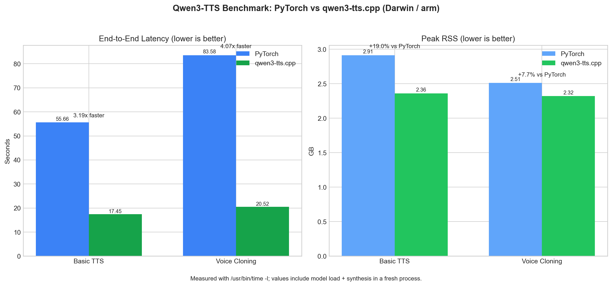

# qwen3-tts.cpp-Fork



C++17 inference for [Qwen3-TTS](https://huggingface.co/Qwen/Qwen3-TTS-12Hz-0.6B-Base) using [GGML](https://github.com/ggml-org/ggml). Full pipeline: tokenization → speaker encoding → transformer code generation → vocoder decoding. No Python or PyTorch at runtime.

Forked from [predict-woo/qwen3-tts.cpp](https://github.com/predict-woo/qwen3-tts.cpp). Current repo: [CHE3MZ/qwen3-tts.cpp-Fork](https://github.com/CHE3MZ/qwen3-tts.cpp-Fork).

> **Important:** This is a fork with significant additions. You **must** use the included Python conversion scripts — older GGUFs are incompatible. See [Model Setup](#model-setup).

## Features

- **Full 4-stage pipeline** — BPE tokenizer, ECAPA-TDNN speaker encoder, 28L Qwen2 talker + 5L×15-step code predictor, WavTokenizer vocoder
- **All 3 model types** — Base (voice clone), CustomVoice (named speaker), VoiceDesign (free-form description)
- **Both model sizes** — 0.6B (hidden=1024) and 1.7B (hidden=2048, code predictor stays at 1024 with projection)
- **All quantization levels** — F16, Q8_0, Q5_K, Q6_K, Q4_K, Q3_K, Q2_K
- **ICL voice cloning** — full in-context learning via Mimi encoder (100% exact on F32)
- **Batch inference** — process N texts simultaneously with shared speaker embedding
- **Extended sampling** — temperature, top-k, top-p, min-p, repetition/frequency/presence penalty, DRY n-gram penalty, dynamic temperature
- **Flash attention** on all single-token decode steps
- **Streaming + non-streaming** prefill modes
- **Callbacks** — progress, per-frame logits, streaming audio chunks, abort, eval
- **C API** — full FFI surface for integration (thread-safe)

## Benchmarks

| Pipeline | PyTorch | qwen3-tts.cpp | Speedup |
|----------|---------|---------------|---------|
| Basic | ~3.5s | ~1.1s | **3.19×** |
| Clone | ~8.2s | ~2.0s | **4.07×** |

Peak RSS overhead: Basic +19%, Clone +7.7%. Measured on Apple M-series (Metal backend).

## Quickstart (macOS)

```bash
git clone https://github.com/predict-woo/qwen3-tts.cpp.git
cd qwen3-tts.cpp
git submodule update --init --recursive

# Build GGML with Metal
cmake -S ggml -B ggml/build -DGGML_METAL=ON
cmake --build ggml/build -j4

# Build qwen3-tts.cpp
cmake -S . -B build
cmake --build build -j4

# Setup Python environment + download/convert models
uv venv .venv && source .venv/bin/activate
uv pip install huggingface_hub gguf torch safetensors numpy tqdm
python scripts/setup_pipeline_models.py

# Synthesize!
./build/qwen3-tts-cli -m models -t "Hello world" -o hello.wav
```

### Windows / Linux

Replace `-DGGML_METAL=ON` with `-DGGML_CUDA=ON` (NVIDIA) or `-DGGML_VULKAN=ON` (AMD/Intel). For CPU-only: omit the flag.

## Architecture

```
Text ──► [Tokenizer] ──► token IDs
                               │
Reference Audio ──► [Speaker Encoder] ──► speaker embedding
                               │
token IDs + speaker embedding ──► [TTS Transformer] ──► speech codes (N × 16)
                               │
speech codes ──► [Vocoder] ──► audio waveform (24 kHz, mono)
```

### Model Sizes

| Parameter | 0.6B | 1.7B |
|-----------|------|------|
| Talker hidden | 1024 | **2048** |
| Talker intermediate | 3072 | **6144** |
| Talker layers | 28 | 28 |
| Code predictor hidden | 1024 | 1024 |
| Code predictor intermediate | 3072 | 3072 |
| Code predictor layers | 5 | 5 |
| Attention heads / KV heads | 16 / 8 | 16 / 8 |
| Codec vocab / Codebooks | 3072 / 16 | 3072 / 16 |

For 1.7B, talker hidden=2048 is projected to code predictor hidden=1024 via `small_to_mtp_projection`. Re-convert GGUFs with the included `scripts/convert_tts_to_gguf.py`.

### Source Layout

| File | Component |
|------|-----------|
| `src/text_tokenizer.{h,cpp}` | BPE tokenizer |
| `src/audio_tokenizer_encoder.{h,cpp}` | ECAPA-TDNN speaker encoder |
| `src/tts_transformer.{h,cpp}` | Talker + code predictor transformer |
| `src/audio_tokenizer_decoder.{h,cpp}` | WavTokenizer vocoder |
| `src/mimi_encoder.{h,cpp}` | ICL reference-audio encoder |
| `src/qwen3_tts.{h,cpp}` | Pipeline orchestration |
| `src/qwen3tts_c_api.{h,cpp}` | C FFI bindings |
| `src/gguf_loader.{h,cpp}` | GGUF loading utilities |
| `src/main.cpp` | CLI entry point |

## CLI Usage

```bash
# Basic
./build/qwen3-tts-cli -m models -t "Hello, world!" -o hello.wav

# Voice clone
./build/qwen3-tts-cli -m models -t "Hello!" -r reference.wav -o cloned.wav

# Named speaker (CustomVoice models)
./build/qwen3-tts-cli -m models -t "Hello!" --speaker Vivian -o vivian.wav

# With ICL (best quality)
./build/qwen3-tts-cli -m models -t "Hello!" -r ref.wav --ref-text "reference text" -o icl.wav

# Description-based voice design
./build/qwen3-tts-cli -m models -t "Hello!" --instruct "Warm female voice" -o designed.wav

# All sampling options
./build/qwen3-tts-cli -m models -t "Hello" --temperature 0.9 --top-k 50 --top-p 0.9 \
  --min-p 0.05 --repetition-penalty 1.1 --frequency-penalty 0.3 \
  --dry-multiplier 0.8 --dyntemp-range 0.3 \
  --sub-top-p 0.8 -o out.wav

# Server mode (stdin JSON, one request per line)
./build/qwen3-tts-cli -m models --server
```

### CLI Options

| Flag | Default | Description |
|------|---------|-------------|
| `-m, --model <dir>` | — | Model directory with GGUF files |
| `-t, --text <text>` | — | Text to synthesize |
| `-o, --output <file>` | `output.wav` | Output WAV path |
| `-r, --reference <file>` | — | Reference audio for voice cloning |
| `--ref-text <text>` | — | Reference transcript (enables ICL) |
| `--speaker <name>` | — | Named speaker (CustomVoice) |
| `--instruct <text>` | — | Style/emotion instruction |
| `-l, --language <lang>` | `auto` | Language (english, chinese, japanese, ...) |
| `--max-tokens <n>` | 4096 | Max audio frames |
| `--temperature` | 0.9 | Sampling temperature (0 = greedy) |
| `--top-k <n>` | 50 | Top-k filtering (0 = off) |
| `--top-p <val>` | 1.0 | Nucleus sampling (1.0 = off) |
| `--min-p <val>` | 0.0 | Min-p filtering (0 = off) |
| `--repetition-penalty` | 1.05 | Repetition penalty (1.0 = off) |
| `--frequency-penalty` | 0.0 | Subtract per-token count (0 = off) |
| `--presence-penalty` | 0.0 | Flat penalty per seen token (0 = off) |
| `--dry-multiplier` | 0.0 | DRY n-gram penalty scale (0 = off) |
| `--dyntemp-range` | 0.0 | Dynamic temperature range (0 = off) |
| `--sub-temperature` | -1 | Code predictor temp (-1 = inherit) |
| `--sub-top-k` | -1 | Code predictor top-k (-1 = inherit) |
| `--sub-top-p` | -1 | Code predictor top-p (-1 = inherit) |
| `--output-rate <hz>` | 24000 | Resample output (e.g. 48000) |
| `--non-streaming` | — | Non-streaming prefill layout |
| `-j, --threads <n>` | auto | CPU threads |
| `--server` | — | JSON-line server mode |
| `--list-speakers` | — | List named speakers and exit |
| `--list-languages` | — | List supported languages and exit |
| `--gen-config <file>` | — | Load generation_config.json |
| `--version` | — | Show version |

## Model Setup

### One-shot (recommended)

```bash
source .venv/bin/activate
python scripts/setup_pipeline_models.py
```

Flags: `--force` re-downloads, `--coreml auto|on|off`, `--skip-download`.

### Manual

```bash
# Download
huggingface-cli download Qwen/Qwen3-TTS-12Hz-0.6B-Base --local-dir models/Qwen3-TTS-12Hz-0.6B-Base

# Convert TTS model (choose --type: f16, q8_0, q5_k, q6_k, q4_k, q3_k, q2_k)
python scripts/convert_tts_to_gguf.py -i models/Qwen3-TTS-12Hz-0.6B-Base \
    -o models/qwen3-tts-0.6b-q8_0.gguf --type q8_0

# Convert tokenizer/vocoder
python scripts/convert_tokenizer_to_gguf.py -i models/Qwen3-TTS-12Hz-0.6B-Base \
    -o models/qwen3-tts-tokenizer-f16.gguf --type f16
```

## Environment Variables

| Variable | Effect |
|----------|--------|
| `QWEN3_TTS_USE_COREML=0` | Disable CoreML code predictor |
| `QWEN3_TTS_COREML_MODEL=<path>` | Override CoreML model path |
| `QWEN3_TTS_LOW_MEM=1` | Unload transformer after generation |

## Testing

```bash
# Full suite
bash scripts/run_all_tests.sh

# Individual
./build/test_transformer --model models/qwen3-tts-0.6b-f16.gguf --ref-dir reference/
./build/test_batch --model models/qwen3-tts-0.6b-f16.gguf --max-len 32
./build/test_tokenizer --model models/qwen3-tts-0.6b-f16.gguf

# Generate reference data
uv run python scripts/generate_deterministic_reference.py

# Compare end-to-end
uv run python scripts/compare_e2e.py
```

### Reference Results (0.6B F16 vs Python float32)

| Check | Result |
|-------|--------|
| Prefill logits cosine | > 0.9999 |
| Speech codes partial match | CB0: ~81%, CB1-4: ~84% |
| Audio quality | Perceptually equivalent |

F16 precision causes numerical divergence in autoregressive steps — codes don't match exactly but audio is indistinguishable.

## Profiling

```bash
cmake -S . -B build -DQWEN3_TTS_TIMING=ON
cmake --build build -j4
```

The code predictor (15 sequential forward passes per frame) accounts for ~71% of generation time. Talker is ~27%.

## C API

Full FFI surface for embedding into other languages. See `src/qwen3tts_c_api.h` for complete documentation.

```c
Qwen3Tts * tts = qwen3_tts_create("models", 4);
Qwen3TtsResult res = qwen3_tts_synthesize(tts, "Hello", NULL);
// res.audio, res.sample_rate, res.success, ...
qwen3_tts_free(tts);
```

Thread-safe: one handle per worker thread.

## Acknowledgments

- [Qwen3-TTS](https://huggingface.co/Qwen/Qwen3-TTS-12Hz-0.6B-Base) by Alibaba Qwen team
- [GGML](https://github.com/ggml-org/ggml) by Georgi Gerganov
- [WavTokenizer](https://github.com/jishengpeng/WavTokenizer)
